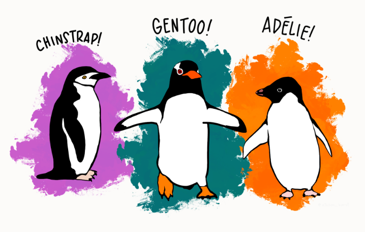

# Rice INDE 577 - Data Science and Machine Learning

Creator: Chenning Liu

## Course Description

This repository contains the code and documentations for the project of INDE 577, Data Science and Machine Learning, at Rice University in Fall 2022. In the course, we learned machine learning algorithms by using python language. Course topics consist of supervised learning, unsupervised learning and reinforcement learning methods.

## Course Instructor

Instructor: Dr. Randy R. Davila

Email: rrd6@rice.edu

## Textbook

- Hands-On Machine Learning with Scikit-Learn, Keras, and TensorFlow, 2nd Edition, by Aurélien Géron
- Machine Learning with Python for Everyone, Addison Wesley Data & Analytics Series, 2020 Pearson Education, by Mark E. Fenner

## Repository Content

### Modules

There are a total of 10 modules in this repository. Each of them can be found in either [Supervised_Learning](https://github.com/Brent-Liu/INDE577/tree/main/Supervised%20Learning) folder or [Unsupervised_Learning](https://github.com/Brent-Liu/INDE577/tree/main/Unsupervised%20Learning) folder. The modules are listed as below:

- Supervied Learning

  - [Perceptron](https://github.com/Brent-Liu/INDE577/tree/main/Supervised%20Learning/Perceptron)
  - [Linear Regression](https://github.com/Brent-Liu/INDE577/tree/main/Supervised%20Learning/Linear%20Regression)
  - [Gradient Descent](https://github.com/Brent-Liu/INDE577/tree/main/Supervised%20Learning/Gradient_Descent)
  - [Logistic Regression](https://github.com/Brent-Liu/INDE577/tree/main/Supervised%20Learning/Logistic%20Regression)
  - [Multilayer Perceptron]
  - [k-Nearest Neighbors](https://github.com/Brent-Liu/INDE577/tree/main/Supervised%20Learning/KNN)
  - [Decision Tree](https://github.com/Brent-Liu/INDE577/tree/main/Supervised%20Learning/Decesion%20Tree)
  - [Ensemble Learning](https://github.com/Brent-Liu/INDE577/tree/main/Supervised%20Learning/Bootstrapping)

- Unsupervised Learning
  - [K-Means Clustering](https://github.com/Brent-Liu/INDE577/tree/main/Unsupervised%20Learning/K-Means_Clustering)
  - [Principle Component Analysis](https://github.com/Brent-Liu/INDE577/tree/main/Unsupervised%20Learning/Principle_Component_Analysis)

## Dataset

In the ten algorithms, I mainly use the palmer penguins dataset, an interesting alternative to Iris data. It is a dataset comprising various measurements of three different penguin species, namely Adelie, Gentoo, and Chinstrap. Same as Iris data which had measurements of three different species of the Iris flower. Anyway, both are great for what they are made of.

The rigorous study was conducted in the islands of the Palmer Archipelago, Antarctica. These data were collected from 2007 to 2009 by Dr. Kristen Gorman with the Palmer Station Long Term Ecological Research Program, part of the US Long Term Ecological Research Network.

More comprehensive introduction of palmer penguins data set is in the [link](https://allisonhorst.github.io/palmerpenguins/). Thanks to 344 adorable penguins from three islands and three species for taking us on a journey of ten algorithms.

## Programming Tools

- Python (version 3.9.7)
- Jupyter Notebook
- Visual Studio Code
- Google Colab
- Git / GitHub
